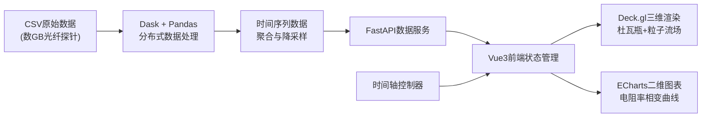

## 1. 产品概述

高温超导（HTS）磁浮列车失焦与热平衡态势可视化大屏系统，面向重型前沿轨道交通论证场景，通过三维可视化与实时数据联动，直观呈现超导带材在运行过程中的热物理状态变化。

- **核心价值**：将数GB级的光纤探针历史数据转化为可交互的可视化态势，辅助科研人员快速识别失超（Quench）前兆，验证热平衡设计方案
- **目标用户**：轨道交通研发工程师、超导物理研究员、系统论证专家

## 2. 核心功能

### 2.1 功能模块
1. **中央三维视窗**：超导杜瓦瓶剖面图 + 液氮沸腾体积流场粒子特效
2. **侧边数据面板**：多测点电阻率相变跃迁时间序列折线图
3. **时间轴控制**：全局时间同步控制器，支持播放、暂停、拖拽定位
4. **数据概览卡片**：关键运行参数实时展示（电流密度、温度、外磁场）

### 2.2 页面详情

| 页面名称 | 模块名称 | 功能描述 |
|-----------|-------------|---------------------|
| 态势大屏 | 中央三维视窗 | Deck.gl渲染杜瓦瓶剖面结构，WebGL粒子系统模拟液氮沸腾冒泡散逸过程 |
| 态势大屏 | 侧边图表面板 | ECharts绘制多通道电阻率随时间变化曲线，标记零电阻态突破阈值 |
| 态势大屏 | 时间轴控制器 | 统一控制三维场景与二维图表的时间进度，支持倍速播放 |
| 态势大屏 | 参数指标卡 | 顶部展示当前时刻的关键物理量统计值与告警状态 |

## 3. 核心流程

用户打开大屏系统 → 后端通过Dask加载预处理CSV数据 → 前端初始化三维场景与图表 → 时间轴播放同步驱动三维粒子动画与二维曲线绘制 → 检测到电阻率突变时触发视觉告警 → 支持拖拽时间轴定位特定时刻进行分析。

## 4. 用户界面设计

### 4.1 设计风格
- **主色调**：深空蓝 `#0a1628` 为背景，超导蓝 `#00d4ff` 为主强调色，液氮青 `#00ffd5` 为辅助色，告警红 `#ff4757` 为警示色
- **字体**：科技感无衬线字体 `Orbitron` 用于标题与数值显示，`JetBrains Mono` 用于数据标签
- **布局**：非对称大屏布局，中央70%区域为三维视窗，右侧30%为垂直堆叠的图表面板，底部贯穿式时间轴
- **视觉特效**：CRT扫描线质感、科技边框发光效果、数据加载时的数据流动画

### 4.2 页面设计概览

| 页面名称 | 模块名称 | UI元素 |
|-----------|-------------|-------------|
| 态势大屏 | 中央三维视窗 | 半透明杜瓦瓶剖面几何、发光粒子系统、剖切面上的温度热力纹理、悬浮式坐标轴刻度 |
| 态势大屏 | 侧边图表面板 | 深色背景折线图、多色曲线区分测点、水平阈值线、相变点高亮标记、随时间同步的垂直游标 |
| 态势大屏 | 时间轴控制器 | 渐变进度条、播放/暂停按钮、倍速选择器、关键事件标记点、时间戳显示 |
| 态势大屏 | 参数指标卡 | 玻璃拟态卡片、发光边框、数值跳动动画、状态指示灯 |

### 4.3 响应性
- 桌面端优先设计，面向4K大屏展示
- 支持1920×1080至3840×2160分辨率自适应
- 最小支持宽度1600px，保证数据可读性

### 4.4 3D场景指导
- **环境**：深色太空背景，低强度环境光配合蓝色方向光，营造低温科技感
- **光照**：主光源从左上方45°入射，带柔和阴影；液氮粒子使用自发光材质，不受环境光影响
- **相机**：初始视角为杜瓦瓶斜前方45°俯视，支持轨道控制缩放和平移，禁止穿越模型内部
- **粒子系统**：2000-5000个动态粒子，从杜瓦瓶底部受热区生成，向上运动过程中逐渐放大并淡出，模拟气泡上升散逸
- **后处理**：轻微Bloom发光效果、色彩分级增强科技感、FXAA抗锯齿
