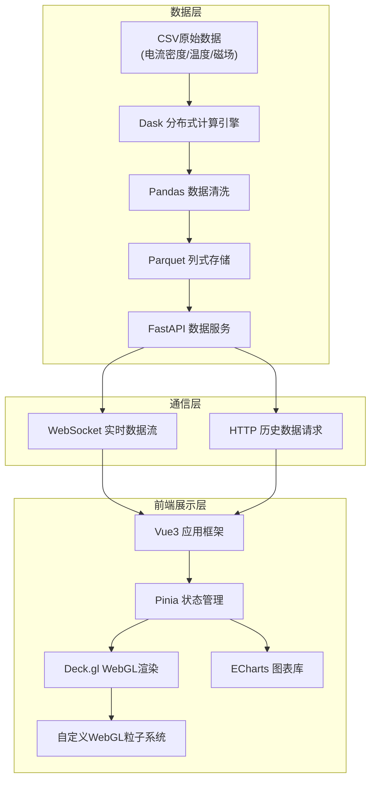

## 1. 架构设计



## 2. 技术描述

- **前端**：Vue@3.4 + TypeScript + Vite@5 + TailwindCSS@3 + Pinia@2
- **三维可视化**：@deck.gl/core@9 + @deck.gl/layers@9 + luma.gl@9
- **图表**：echarts@5
- **后端数据处理**：Python 3.11 + Dask@2024 + Pandas@2 + FastAPI@0.110
- **数据格式**：原始CSV → Dask处理 → Parquet缓存 → API输出JSON

## 3. 目录结构

```
├── api/                          # Python后端
│   ├── data_processor.py         # Dask + Pandas数据处理
│   ├── main.py                   # FastAPI入口
│   ├── models.py                 # 数据模型
│   └── sample_data/              # 模拟数据生成
├── src/
│   ├── components/
│   │   ├── CryostatViewer.vue    # 杜瓦瓶三维视图
│   │   ├── ResistivityChart.vue  # 电阻率图表
│   │   ├── TimelineControl.vue   # 时间轴控制
│   │   ├── MetricCard.vue        # 指标卡片
│   │   └── ParticleSystem.vue    # 粒子系统组件
│   ├── composables/
│   │   ├── useDeckGl.ts          # Deck.gl封装
│   │   ├── useTimeSync.ts        # 时间同步逻辑
│   │   └── useWebSocket.ts       # WebSocket通信
│   ├── stores/
│   │   └── dataStore.ts          # Pinia数据状态
│   ├── types/
│   │   └── index.ts              # TypeScript类型定义
│   ├── utils/
│   │   ├── color.ts              # 颜色映射
│   │   └── geometry.ts           # 几何计算
│   ├── App.vue
│   └── main.ts
└── shared/
    └── types.ts                  # 前后端共享类型
```

## 4. API 定义

### 4.1 数据模型

```typescript
// 测点数据
interface SensorData {
  timestamp: number;
  sensorId: string;
  currentDensity: number;  // A/cm²
  temperature: number;     // K
  magneticField: number;   // T
  resistivity: number;     // Ω·m
}

// 时间序列查询参数
interface TimeSeriesQuery {
  startTime: number;
  endTime: number;
  sensorIds?: string[];
  downsample?: number;      // 降采样因子
}

// 粒子状态
interface ParticleState {
  id: number;
  position: [number, number, number];
  velocity: [number, number, number];
  size: number;
  opacity: number;
  temperature: number;
}

// 全局状态
interface GlobalState {
  currentTime: number;
  isPlaying: boolean;
  playbackSpeed: number;
  quenchDetected: boolean;
}
```

### 4.2 接口定义

| 方法 | 路径 | 描述 |
|------|------|------|
| GET | `/api/sensors` | 获取所有测点列表 |
| GET | `/api/timeseries` | 查询时间序列数据 |
| GET | `/api/summary` | 获取指定时间点的汇总统计 |
| GET | `/api/particles` | 获取指定时间窗口的粒子数据 |
| WS | `/ws/stream` | 实时数据流WebSocket |

## 5. 核心技术实现

### 5.1 Dask大数据处理

- 使用Dask DataFrame分块读取数GB级CSV文件，每块64MB
- 延迟计算（Lazy Evaluation）配合 persist() 缓存常用数据
- 按时间戳排序分区，支持快速时间范围查询
- 计算电阻率：ρ = f(T, B, J) 基于超导物理模型

### 5.2 Deck.gl三维渲染

- `ScatterplotLayer` 渲染粒子系统，支持60FPS@5000粒子
- `SolidPolygonLayer` 渲染杜瓦瓶剖面几何，使用半透明材质
- `HeatmapLayer` 在剖切面叠加温度分布
- 自定义 `Layer` 实现体积流场粒子的物理运动

### 5.3 时间同步机制

- 使用 `requestAnimationFrame` 驱动全局时间线
- 三维场景与二维图表共享同一 `currentTime` 状态
- 粒子位置根据时间戳插值计算，保证动画流畅
- 电阻率游标与时间进度实时联动

### 5.4 失超检测算法

- 实时监控电阻率突变率 dρ/dt
- 超过预设阈值时触发告警状态
- 高亮显示相变跃迁点，三维粒子速度与密度同步增加
